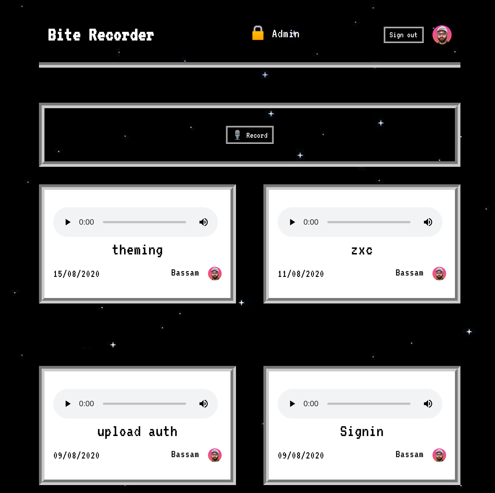
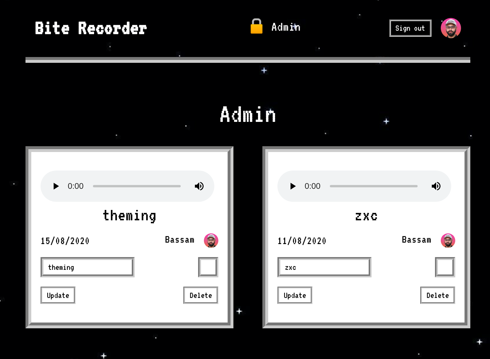
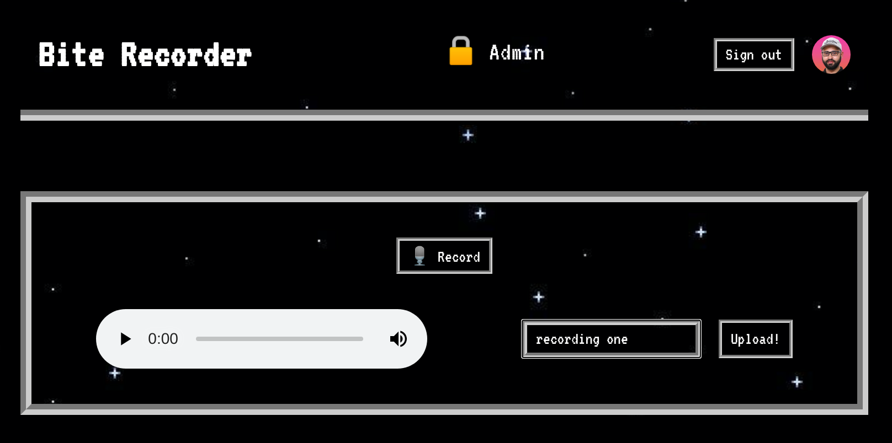

# Bite Recorder
> Record sound bites from your Browser

## Setup
- Clone the repository
- run `npm i`
- run `npm run dev` to start the development server
- run `npm run build` to generate a production build

## Architecture
- The application is built on top of Next.js which is internally using React for
  the UI and Node.js for the Lambda functions.
- To record the Bites, we use the MediaRecorder API which can access your
  microphone. There is no support in Safari currently and some limitations under
  the Blink engine.
- The recorded Bites are stored on AWS S3.
- We store all the data on Airtable. The data stored is limited to: Bite (Name,
  URL) and User (Name, email, and Image).
- Authentication is done using GitHub and it acts as the source of user data.
- As a admin user, one can approve the submited sounds.

## Screenshots

### Info

- [Twitch](https://www.twitch.tv/skippednote)
- [Twitter](https://www.twitter.com/skippednote)
- [GitHub](https://www.github.com/skippednote)
